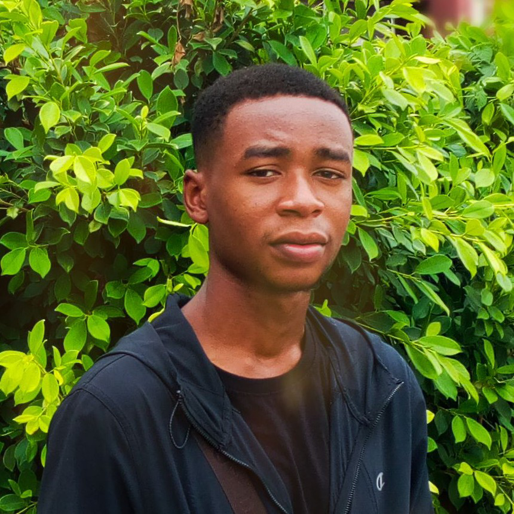

```{r setup, include=FALSE}
knitr::opts_chunk$set(echo = FALSE)

# Learn more about creating websites with Distill at:
# https://rstudio.github.io/distill/website.html

```


{width=15,height=20}  

  Hi there!   

  I’m Emmanuel Ugochukwu, a final year student of Electrical Electronics Engineering at the Federal University of Technology, Owerri, Nigeria. I learn languages for the fun of it. At the moment, I am an active Spanish speaker and an active German learner. I also love to work with data, create visualizations, models, reports, shiny web applications and recently started writing to improve my storytelling capabilities.  
  Soon, I will be diving into building APIs and learning web scraping, SQL and a lot more. I am an active learner, I am very positive that i can achieve that.  Currently, I started a course STAT494: Advanced Data Science in R by Lisa Lendway. I really love the syllabus and i am looking forward to completing the course.
  Thanks for visiting.

